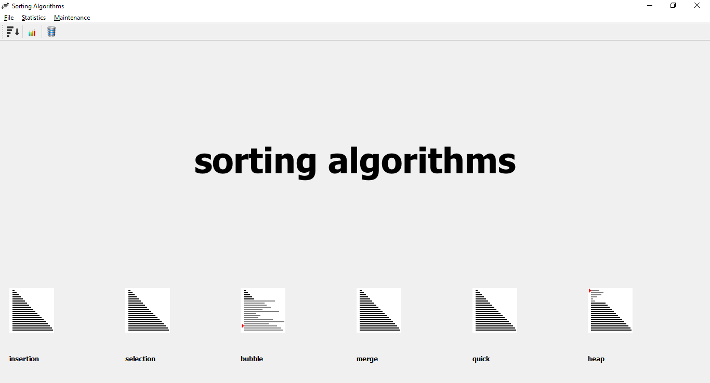
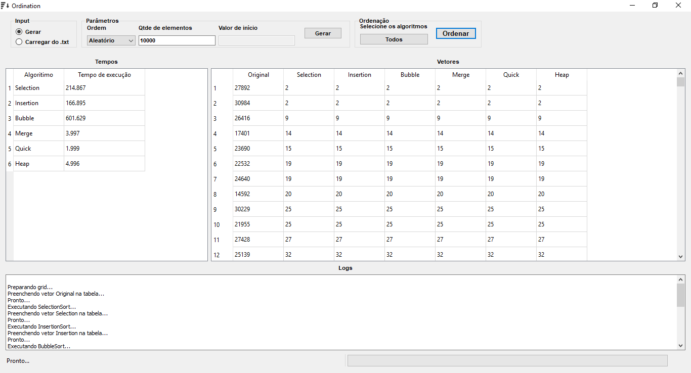
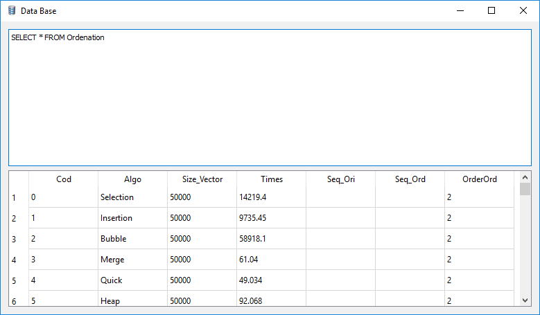
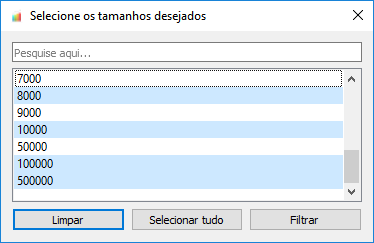
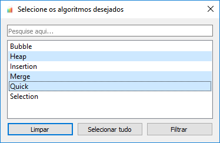
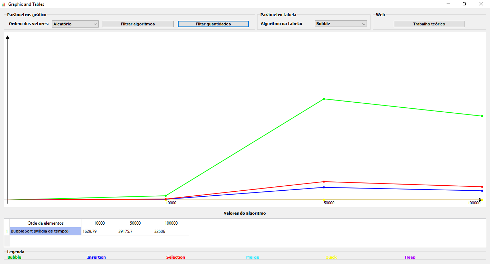
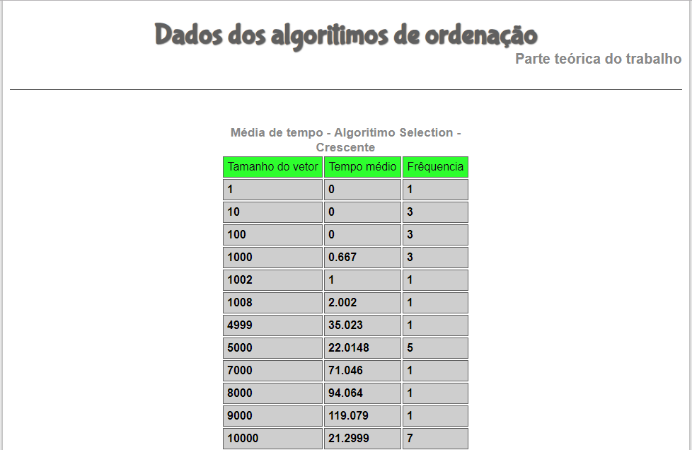
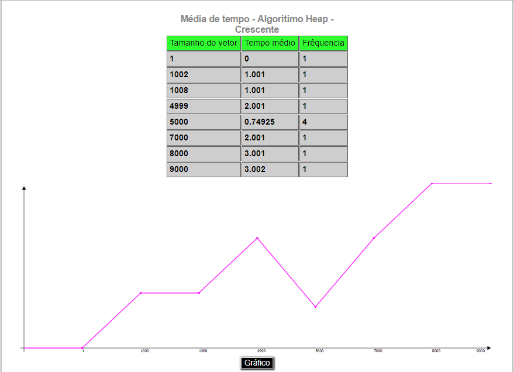

# Tool Sorting Algorithms
Tool for the study of ordering algorithms.

This tool presents and compares the main sorting algorithms (14 of them). The software presents gifs to aid in the understanding of algorithms, sorts data files with any of the available algorithms as well as generates vectors (increasing, decreasing or random) for the algorithms test. The tool also stores all ordering data in a database so that graphs and reports can be generated. Finally, this tool assembles and presents a web page with a report with various data and statistics.

This project was developed with C++ (and Qt), Html, Css, JavaScript, and MySQL.

Link: https://github.com/Jonlenes/ToolSortingAlgorithms

  

  

  

  

  

  

  

  

